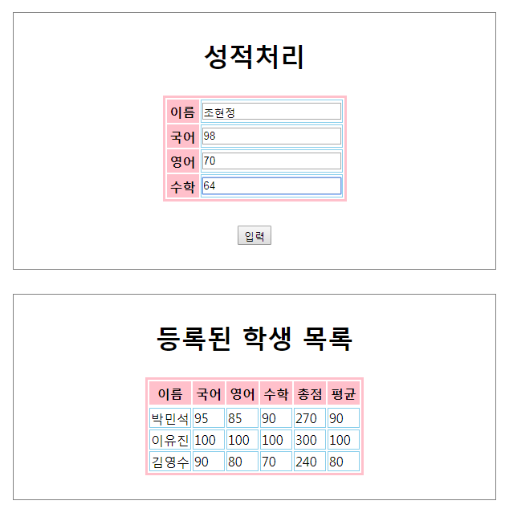
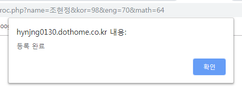
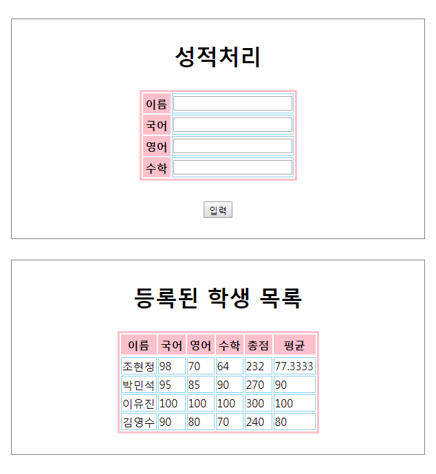

## PHPStudentScores

### 개요
* PHP로 구현한 간단한 성적관리 페이지입니다.

### 설명
* 이름, 국어 점수, 수학 점수, 영어 점수를 입력하면 자동으로 총점과 평균을 계산하여 출력합니다.
* 입력된 데이터는 DB에 저장됩니다.

### 기술
* PHP
* Visual Studio Code
* phpMyAdmin
* 닷홈(dothome) 무료 호스팅
* GitHub Desktop, GitHub

### 미리보기

